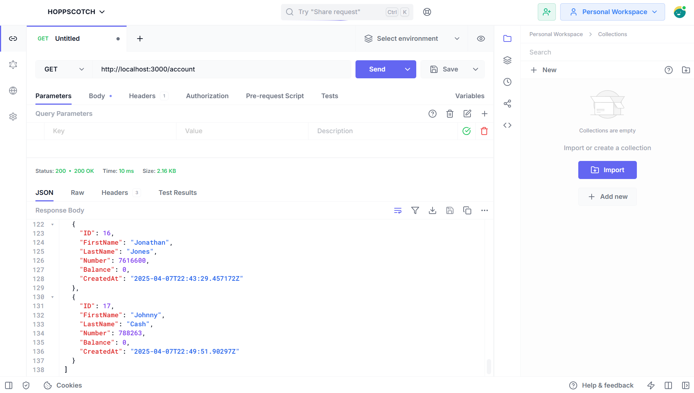
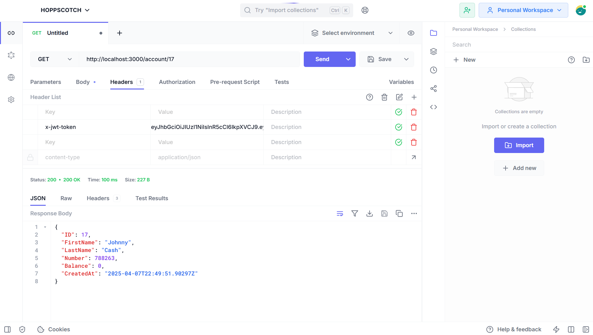
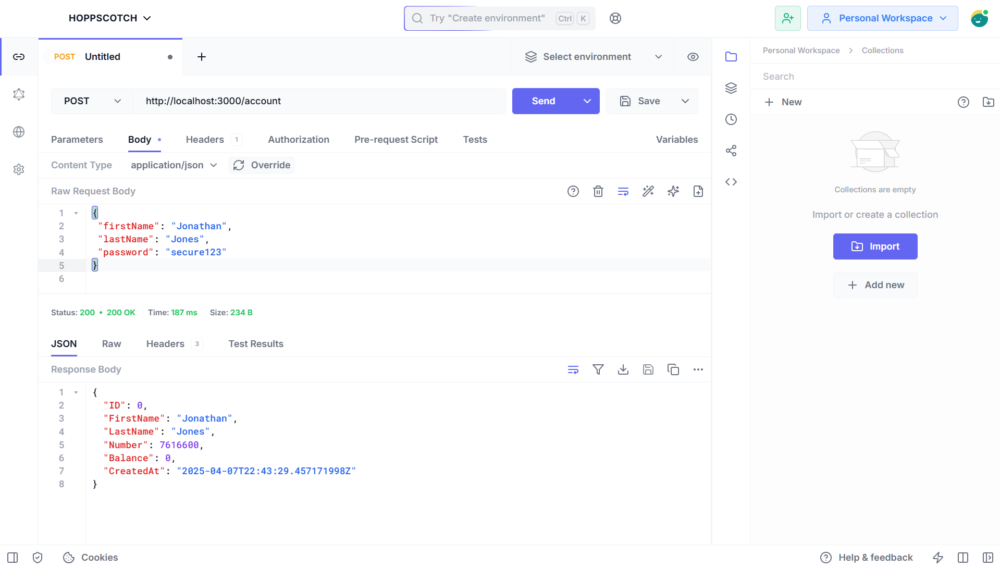
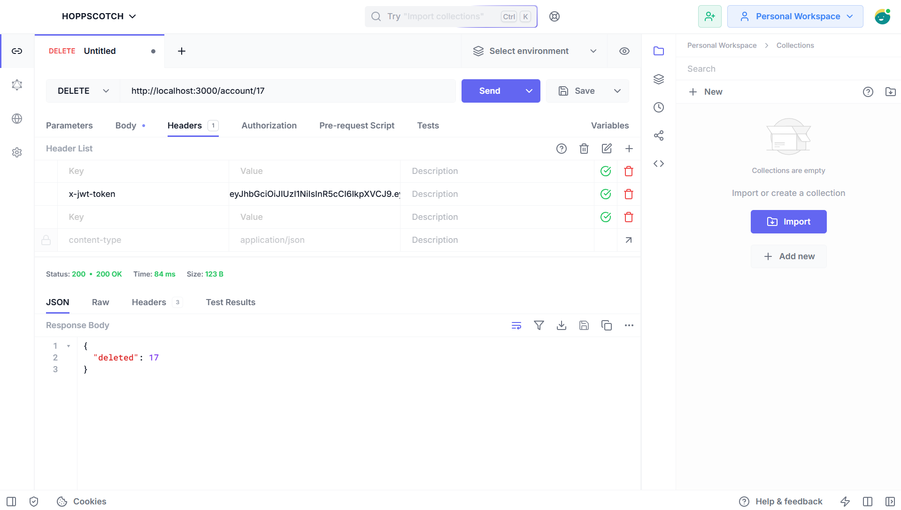
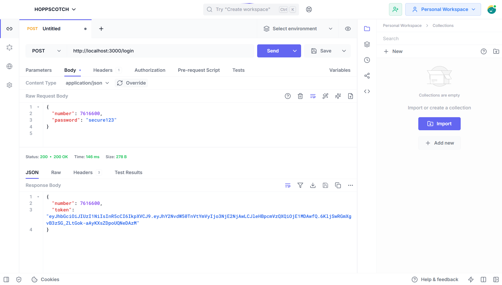
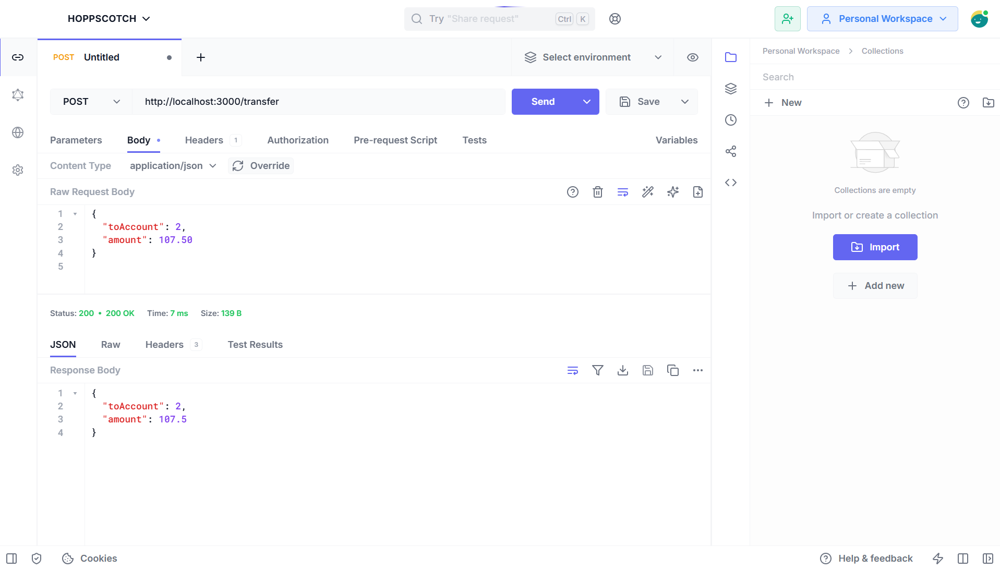

# Drouhlin

## Overview
Drouhlin is a RESTful API built with Go that enables users to manage bank accounts and perform basic financial operations. It supports account creation, retrieval, deletion, and fund transfers, with secure authentication via JWT (JSON Web Tokens). The project uses Gorilla Mux for routing and PostgreSQL for persistent storage, storing account details like ID, name, number, balance, and encrypted password.

## Features
- **GET /account**: Retrieve all accounts.
- **GET /account/{id}**: Retrieve a specific account by ID (JWT-protected).
- **POST /account**: Create a new account with a randomly generated number and encrypted password.
- **DELETE /account/{id}**: Delete an account by ID (JWT-protected).
- **POST /login**: Authenticate a user and return a JWT token.
- **POST /transfer**: Initiate a fund transfer between accounts (stubbed for extension).

## Technologies Used
- **Go (Golang)**: Backend language.
- **Gorilla Mux**: HTTP router for handling routes.
- **PostgreSQL**: Database for storing account data (via `lib/pq` driver).
- **JWT**: Authentication using `golang-jwt/jwt`.
- **bcrypt**: Password hashing via `golang.org/x/crypto/bcrypt`.
- **Hoppscotch**: For testing API endpoints.

## Screenshots
Below are screenshots of the API in action using Hoppscotch, demonstrating each key operation:

### GET All Accounts
**GET All Accounts**: This screenshot shows a `GET /account` request in Hoppscotch, retrieving the full list of accounts. The response includes all accounts with their IDs, first names, last names, numbers, balances, and creation timestamps (passwords excluded). Capture this after seeding the database to display multiple accounts.

### GET Account by ID
**GET Account by ID**: This screenshot demonstrates a `GET /account/{id}` request in Hoppscotch, fetching a specific account by its ID. Include the `x-jwt-token` header with a valid token from a prior login. The response shows the details of the requested account, such as name, number, and balance.

### POST Create Account
**POST Create Account**: This screenshot illustrates a `POST /account` request in Hoppscotch, creating a new account. The request body includes `firstName`, `lastName`, and `password` (e.g., `{ "firstName": "Jane", "lastName": "Doe", "password": "secure123" }`). The response displays the newly created account with a randomly generated `number`.

### DELETE Account
**DELETE Account**: This screenshot shows a `DELETE /account/{id}` request in Hoppscotch, removing an account by its ID. Include the `x-jwt-token` header with a valid token. The response confirms the deletion with a JSON object like `{ "deleted": <id> }`.

### POST Login
**POST Login**: This screenshot captures a `POST /login` request in Hoppscotch, authenticating a user. The request body includes `number` and `password` (e.g., `{ "number": 4528296, "password": "hunter888" }` after seeding). The response returns a JWT token and the account number, like `{ "token": "eyJhbGciOiJIUzI1NiIs...", "number": 4528296 }`.

### POST Transfer
**POST Transfer**: This screenshot displays a `POST /transfer` request in Hoppscotch, initiating a fund transfer. The request body includes `toAccount` and `amount` (e.g., `{ "toAccount": 2, "amount": 100.50 }`). The response echoes the request data since the transfer logic is stubbed.

