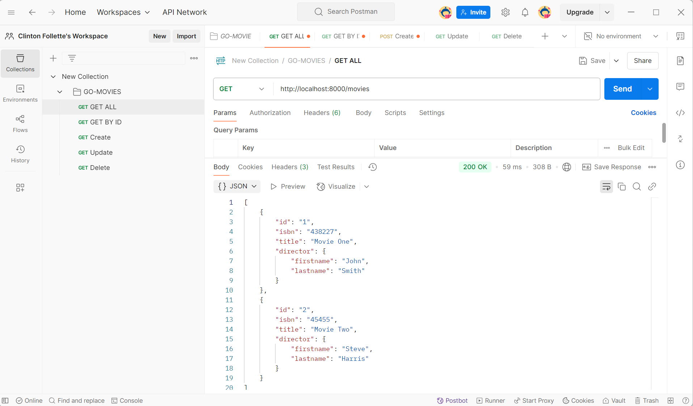
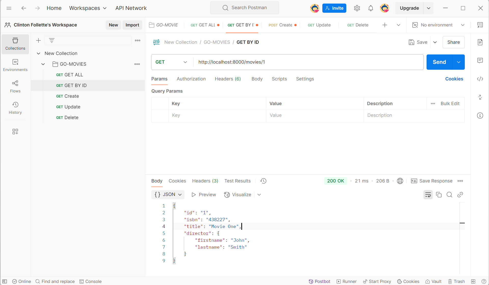
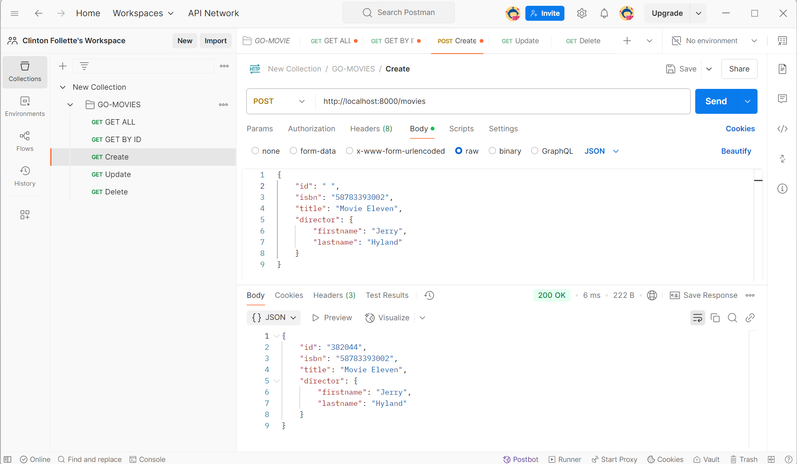
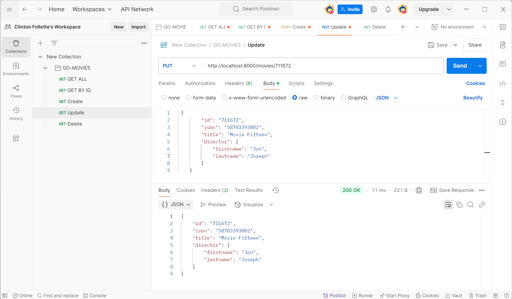
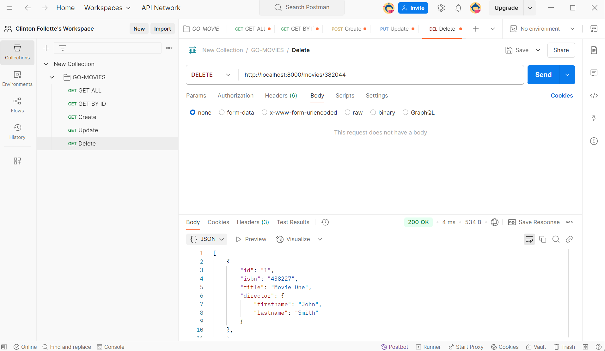

## Project: Go-Movies-Crud

### Overview
`go-movies-crud` is a RESTful API built with Go that allows users to manage a collection of movies. It supports full CRUD operations (Create, Read, Update, Delete) and uses the Gorilla Mux router for handling HTTP requests. The project stores movie data in memory (a slice) and includes fields for movie ID, ISBN, title, and director details.

### Features
- **GET /movies**: Retrieve all movies.
- **GET /movies/{id}**: Retrieve a specific movie by ID.
- **POST /movies**: Create a new movie with a randomly generated ID.
- **PUT /movies/{id}**: Update an existing movie.
- **DELETE /movies/{id}**: Delete a movie by ID.

### Technologies Used
- **Go (Golang)**: Backend language.
- **Gorilla Mux**: HTTP router for handling routes.
- **Postman**: For testing API endpoints.
## Screenshots
Below are screenshots of the API in action using Postman, demonstrating each CRUD operation:

#### GET All Movies

This screenshot shows a `GET /movies` request, which retrieves the full list of movies stored in the API. The response includes all movies with their IDs, ISBNs, titles, and director details.

#### GET Movie by ID

This screenshot demonstrates a `GET /movies/{id}` request, fetching a specific movie by its ID. The response shows the details of the requested movie, including its title and director information.

#### POST Create Movie

This screenshot illustrates a `POST /movies` request, creating a new movie. The request body includes the movie details (e.g., title, ISBN, director), and the response shows the newly created movie with a randomly generated ID.

#### PUT Update Movie

This screenshot displays a `PUT /movies/{id}` request, updating an existing movie. The request body contains the updated movie details, and the response confirms the movie has been updated with the new information.

#### DELETE Movie

This screenshot shows a `DELETE /movies/{id}` request, removing a movie by its ID. The response confirms the movie has been successfully deleted, and a subsequent GET request would no longer return that movie.
